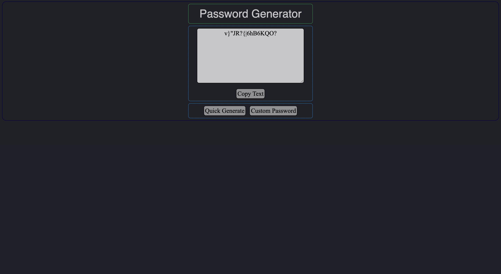

# Password Generator

## Table of Contents
[Project Link](#Link)  
[Technologies](#Technologies)  
[Description](#Description)  
[Screenshots](#Screenshots)  
[License](#License)  
[Contact](#Contact)

## Link
https://dalto135.github.io/password-generator/

## Technologies
HTML, CSS and Javascript

## Description
A simple program that generates a random password. The user can click "Quick Generate" to instantly create a password, or they can create a custom password where they choose the length, and whether the password includes uppercase and lowercase letters, numbers and special characters.

## Screenshots

## License
MIT

## Contact
Dalton Wilkins - daltongh@gmail.com
